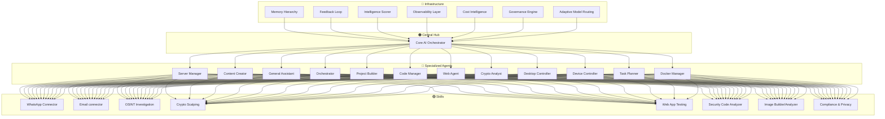

# ClawBot Multi-Agent Orchestration Architecture

Visual map: **central AI brain** → **specialized agents** → **skills** → **infrastructure layers**.  
Aligned with [ARCHITECTURE.md](./ARCHITECTURE.md) (WhatsApp + Apple Notes) and [CLAWBOT_INFRA.md](./CLAWBOT_INFRA.md) (OpenClaw).

---

## 1. Graph Overview

| Layer | Shape | Role |
|-------|--------|------|
| **Central Hub** | Orange (ring/sun) | Core AI orchestrator — routes requests, decides which agent/skill to use |
| **Agents** | Blue (hexagons) | Specialized workers — Server, Content, Code, Docker, Researcher, etc. |
| **Skills** | Purple (nodes) | Capabilities — WhatsApp, Email, OSINT, Security, etc. |
| **Tools** | Green (spheres) | Atomic integrations — github, openclaw, browser, email, db, workflow, etc. |
| **Infrastructure** | Orange (diamonds) | Meta layers — Memory, Observability, Cost, Governance |

---

## 2. Central Hub (Orchestrator)

- **Single node:** Core AI orchestrator.
- **Responsibilities:** Understand user intent (from WhatsApp/Telegram), choose agent(s) and skill(s), coordinate workflows, return answers or persist to Apple Notes per [ARCHITECTURE.md](./ARCHITECTURE.md) persistence rules.
- **In OpenClaw:** Maps to the primary agent (e.g. default agent with GPT-5.2 / codex-mini) that does routing; can be extended with a dedicated “orchestrator” agent if desired.

---

## 3. Specialized Agents (Blue Hexagons)

| Agent | Purpose | ClawBot / OpenClaw mapping |
|-------|---------|----------------------------|
| **Server Manager** | Servers, SSH, deployments, health | New skill or agent: server-ops, uptime checks |
| **Content Creator** | Drafts, posts, media | Content/social skills |
| **General Assistant** | Q&A, summaries, ad-hoc tasks | Current default agent behavior |
| **Orchestrator** | Sub-routing, multi-step plans | Can be same as Central Hub or a dedicated router agent |
| **Project Builder** | Project setup, scaffolding, milestones | Skill: project templates, status → Apple Notes Projects |
| **Code (Manager)** | Code generation, review, refactor | Existing coding skill |
| **Web Agent** | Browsing, scraping, form fill | Web/selenium/playwright skill |
| **Crypto Analyst** | Crypto data, alerts, portfolio | Crypto skill (e.g. Crypto Scalping) |
| **Desktop Controller** | Local OS actions (Mac) | AppleScript/shell skill |
| **Device Controller** | Smart home / devices | Future: HomeKit or device API skill |
| **Task Planner** | Tasks, reminders, follow-ups | Maps to Apple Notes Tasks + 📌 Tasks folder |
| **Docker Manager** | Containers, images, compose | New skill: docker CLI / API |
| **Researcher** | Search, synthesis, sources | Research skill / web + search tools |

Each blue node is an **agent** (or agent role) the hub can invoke; implementation can be one OpenClaw agent with multiple “modes” or multiple OpenClaw agents.

---

## 4. Skills / Capabilities (Purple Nodes)

| Skill | Purpose | Status in ClawBot |
|-------|---------|-------------------|
| WhatsApp Connector | Chat gateway | ✅ Channel + keepalive |
| Email connector | Mail read/send, digests | ✅ ClawMail, graph_mail_pull, mail-filter-to-wa |
| OSINT Investigation | Open-source intel | Add as skill |
| Crypto Scalping | Crypto signals/trades | Add or existing |
| Web App Testing | Automated testing | Add as skill |
| Security Code Analyzer | Code/ dependency security | Add as skill |
| Safety Simulator | Risk/safety checks | Add as skill |
| Image Builder/Analyzer | Generate/analyze images | Add or existing |
| Compliance & Privacy | Policies, consent, retention | Add as skill / rules in orchestrator |
| *(Many more)* | Expand as needed | 47 skills today; grow to match list |

Purple = **skills** in OpenClaw terms (FastAPI plugins, tools the agents call). Hub and blue agents use these.

---

## 4b. Tools / Atomic Capabilities (Green Spheres)

Smaller nodes representing low-level integrations and connectors that skills and agents rely on:

| Tool | Role |
|------|------|
| github, openclaw | Code & framework integration |
| memory, browser, email, db, search | Data & access |
| workflow, cron | Automation triggers |
| desktop, device, scope | Local & device control |
| social-me, download, enterprise, claude-c | External services |
| web, file, bash, loading | Execution environment |

Agents and skills connect to these tools; the dense green cluster around the graph reflects the reference architecture.

---

## 5. Infrastructure / Meta Layers (Orange Diamonds)

| Layer | Purpose |
|-------|---------|
| **Memory Hierarchy** | Short-term (session) + long-term (Apple Notes, vector DB). Matches ARCHITECTURE.md: Notes = brain. |
| **Feedback Loop** | User corrections, thumbs up/down, “save this” / “forget this” → improve routing and persistence. |
| **Intelligence Scorer** | Quality/relevance scoring for responses and stored items. |
| **Observability Layer** | Logs, metrics, traces (gateway, agents, skills). |
| **Cost Intelligence** | Token/model cost tracking; feed into Adaptive Model Routing. |
| **Governance Engine** | Policies: what can be persisted, which services can be called, compliance. |
| **Adaptive Model Routing** | Route routine tasks to cheaper model, complex to GPT-5.2 (see CLAWBOT_INFRA). |
| **SEO Analytics Builder** | If you do content/sites: SEO metrics and suggestions. |
| **SaaS Builder** | If you build internal tools: scaffolding, config, deployment. |

These are **cross-cutting**: they don’t handle messages directly but support the hub, agents, and skills.

---

## 6. 3D Interactive View

Open **`docs/architecture-3d.html`** in a browser for a 3D force-directed graph of the same architecture. Drag to rotate, scroll to zoom, right-drag to pan; click a node to focus the camera. Uses [3d-force-graph](https://github.com/vasturiano/3d-force-graph) (Three.js).

---

## 7. Visual Diagram (Mermaid)



---

## 8. Graph Data (for dashboard UI)

Structured list for a future orchestration dashboard (e.g. React Flow, D3, or Moltbot):

```yaml
# multi_agent_graph.yaml - node definitions for dashboard
hub:
  id: orchestrator
  label: Core AI Orchestrator
  shape: sun
  color: orange

agents:
  - id: server-manager
    label: Server Manager
  - id: content-creator
    label: Content Creator
  - id: general-assistant
    label: General Assistant
  - id: orchestrator-agent
    label: Orchestrator
  - id: project-builder
    label: Project Builder
  - id: code-manager
    label: Code Manager
  - id: web-agent
    label: Web Agent
  - id: crypto-analyst
    label: Crypto Analyst
  - id: desktop-controller
    label: Desktop Controller
  - id: device-controller
    label: Device Controller
  - id: task-planner
    label: Task Planner
  - id: docker-manager
    label: Docker Manager

skills:
  - WhatsApp Connector
  - Email connector
  - OSINT Investigation
  - Crypto Scalping
  - Web App Testing
  - Security Code Analyzer
  - Safety Simulator
  - Image Builder/Analyzer
  - Compliance & Privacy

infrastructure:
  - Memory Hierarchy
  - Feedback Loop
  - Intelligence Scorer
  - Observability Layer
  - Cost Intelligence
  - Governance Engine
  - Adaptive Model Routing
  - SEO Analytics Builder
  - SaaS Builder
```

---

## 9. Implementation Phases

| Phase | Focus | Deliverable |
|-------|--------|-------------|
| **1** | Document + diagram | This doc + Mermaid + YAML (done) |
| **2** | Dashboard view | Render graph in Moltbot or standalone page (Mermaid or React Flow) |
| **3** | Hub routing | Orchestrator logic: intent → agent/skill selection (in OpenClaw agent or skill) |
| **4** | Agents | Add or map OpenClaw agents for Server, Docker, Task Planner, etc. |
| **5** | Skills | Add missing purple skills (OSINT, Security Analyzer, Compliance, etc.) |
| **6** | Infra | Memory (Notes), Observability, Cost tracking, Model routing |

---

## 10. Alignment with ARCHITECTURE.md

- **WhatsApp** = primary input; hub receives from WhatsApp (and Telegram).
- **Apple Notes** = Memory Hierarchy + 📌 Tasks, 📂 Projects, 🚨 Security, 💳 Payments, etc.
- **Persistence rules** = only save when incoming system info, future value, final result, or user says “save this” / “create a task” / “keep this” / “track this”.
- **Device strategy** = minimal WhatsApp linked devices; Notes handle persistence.

The multi-agent graph is the **control and capability layer**; ARCHITECTURE.md defines **where** data lives and **when** it is stored.
